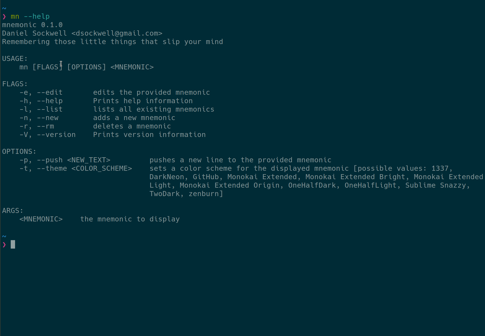

# Mnemonic

Mnemonic is a CLI app for remembering those little things that slip your mind.

I frequently forget things—nothing big, just little Unix commands that I don't use often enough to commit to memory, small details that might slip my mind, things like that.

I used to keep a `notes` text files saved in my home directory then run `cat ~/notes` to jog my memory.  But then I decided there had to be a better—and prettier—way.  But **crucially**, a way that preserves the simplicity of typing `cat ~/notes`.

And thus, **Mnemonic** was born.  Invoke it with the `mn` command to quickly print a syntax-highlighted mnemonics to your terminal.  Here it is in action:



## Installation 

Install with `cargo install mn`.  Optionally, clone the git repository and run `sudo make install` to install the `man` page and the Zsh completions.  The git repository also contains generated completions for Bash, Fish, and Elvish; if you use any of those shells, you can install the completions in the appropriate way for your shell.

## Usage
Run `mn --help` for full usage details.  The basic commands are `mn <MNEMONIC>`, which shows a previously created mnemonic; `mn --list`, which lists all existing mnemonics, `mn --new <MNEMONIC>`, which creates a new mnemonic using your `$EDITOR`, and `mn --edit <MNEMONIC>`, which edits an exiting mnemonic.

You can also use `mn <MNEMONIC> --push "<TEXT>"` to push text to a mnemonic without opening it in your editor.

## Syntax highlighting
Mnemonic highlights all output as Markdown.  If you wish a portion of text to be highlighted as a different language, you can use GitHub-style code-fences.  For example,

<pre>
```rust
fn main() {
    println!("Hello, world!");
}

```
</pre>

would display syntax highlighting similar to
```rust
fn main() {
    println!("Hello, world!");
}

```

The syntax highlighting theme is user-configurable with the same themes used in [Bat](https://github.com/sharkdp/bat), which was a major inspiration for this project.

